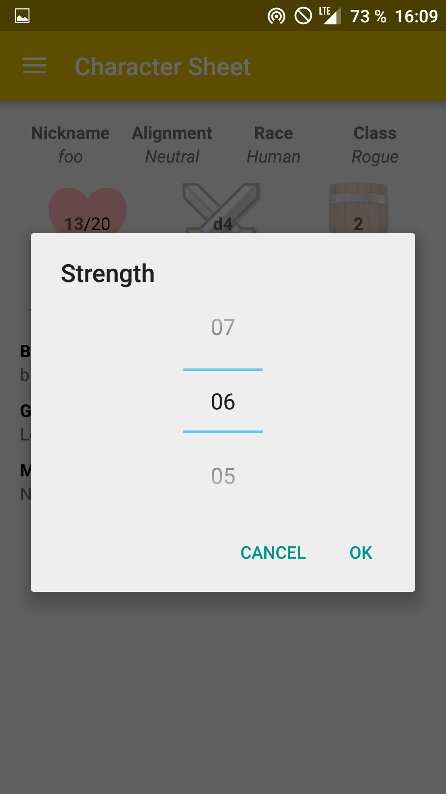
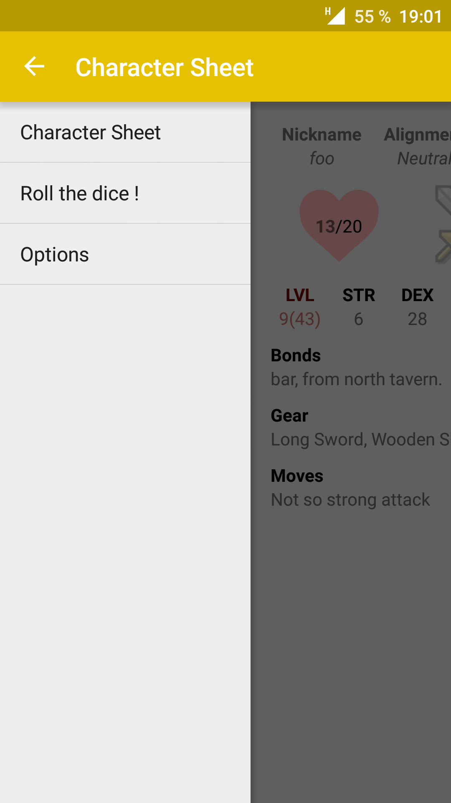

<center>RPGManager</center>
==========
<center>_Character sheet manager for role-playing games._</center>

## Description


This application is used for table-top role playing
games, like Dungeons & Dragons or Pathfinder. The
goal is to make each player use the application for
his character. The main activity of the app is the
character sheet. It is used like a character sheet in
real table-top RPGs.
This application also allow the user to throw a dice,
with dices between a 4-faces to a 30-faces dice.
This application interacts with a server through JSON and gets all the data
from the website where the game master leads the
game from.

<center></center>
<center>_Dungeon World character sheet_</center>

## Activities

### Character Sheet Activity

This activity is used to display the specifications of the character chosen in the options.
All the information displayed is taken from the website.
The main information (nickname, alignment, race and class) about the character are displayed on top. Then are the health, the dice of attack and the defense of the character. The characteristics (Level, Experience, Strength, Dexterity, Constitution, Intelligence, Wisdom and Charisma) come next and are editable by the user through a NumberPicker which is displayed when clicking on the characteristic. Then, there are the bonds, gears and moves of the character.

<center></center>
<center>_RPGManager main activity_</center>
<center></center>
<center>_The user can modify the value of his stats_</center>

### Dice Activity
This activity is just a button with a dice image on it. When clicking the button, a pop-up appears and the user is able to change the number of faces of the dice.
In this activity, we are able to shake the device to launch a dice a gives a random number.

<center></center>
<center>_The user can choose what dice he has to roll_</center>
<center></center>
<center>_After shaking the device, we can see the roll on the screen_</center>

### Options Activity
There are 4 options: the URL of the server to connect, the nickname to load when refreshing the data, the language to select (English and French), and a check box to enable or disable notifications. Upon testing the URL, a message appears if the destination is reachable.
When changing the language, the button reloads the current activity to charge the newly selected language.

<center></center>
<center>_Here we can configure the server location, the nickname of the player, and some other things_</center>

## Background Services
The background service we are using is simple: every 30 seconds, the level and the health of the character are checked from the server. If the health came down to 0 during the 30 seconds, a notification pops up. And if the character leveled up during the 30 seconds, another notification pops up.
Before getting the data from the server, the service looks up for the notification option in the Option Activity to see if the user decided to stop receiving notifications. This service stops as soon as the notification check box is unchecked and restarts when it is checked again.

<center></center>
<center>_The notifications tells the user when he dies or levels up_</center>

## Drawer

To switch between applications, we used a navigation drawer. This menu is declared in the DrawerActivity (which extends AppCompatActivity) and each of our activity extends this DrawerActivity. Each of these activities are declared with `android:launchMode="singleTask"` and are called via the intent flag `Intent.FLAG_ACTIVITY_REORDER_TO_FRONT`.
To launch the background task, we use a category on the intent `notifIntent.addCategory(NotificationService.TAG);` ( NotificationService.TAG being a public String with a specific name) to be able to call it from different activities. We first stop the service and then starts it so it doesn't launch twice.

<center></center>
<center>_The drawer provides an easy way to switch between the different activities_</center>

## Sensor

In this application we use the accelerometer of the device as our sensor. It is used in order to detect, in the _Dice Activity_, when the user is shaking his device. When we detect that it's the case, we display the result of the dice roll.

## Server communication

The application makes requests to a HTTP Server, who will answer by sending a JSON response.
For example, if we want to get the _strength_ value of the player _foo_, the application will query the server with
```
http://serverlocation/rpgm/action.php?a=get&id=foo&field=str
```
and get this JSON answer :
```json
  {"success":true,"field":"str","value":"6"}
```

The server itself handles four actions :

* `createUser` by POST, in order to create a user
* `rmUser` by GET, in order to remove a user
* `get` by GET, in order to recieve the stats of a user,
* `update` by GET, in order to change one of the user's values,
